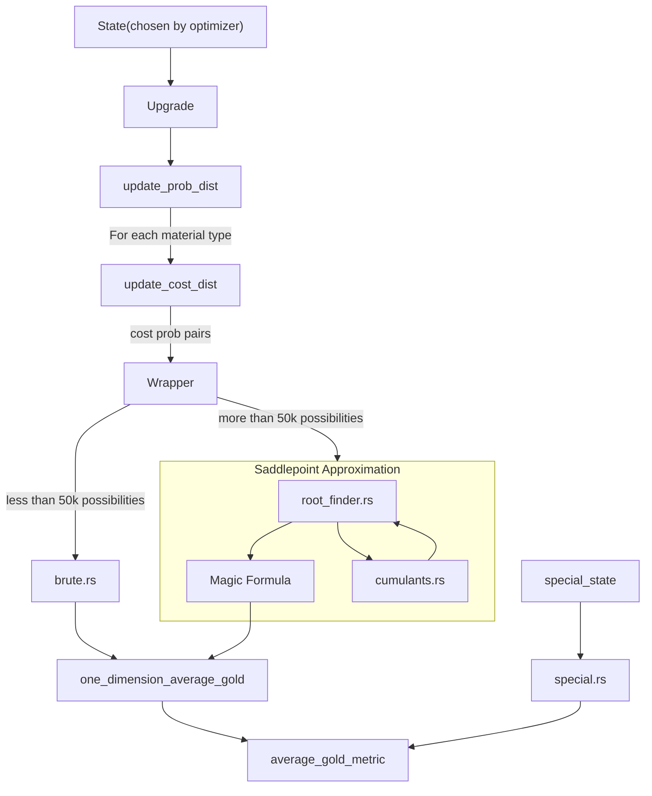

# Average Evaluation

The naive computation of E[f(Y)] requires us to compute every possible outcome and their possibilities. For example, for two dice, we need to consider (1,1), (1,2) ... (1,6) ... (2,1) ... (6,6) , for a total of 36. This grows exponentially with the number of upgrades and is infeasible in general, hence the trouble we go through to employ [saddlepoint approximation](/docs/Saddlepoint%20Approximation.pdf).

When [naive brute force](/crates/core/src/core/brute.rs) is feasible (less than 50k total possibilities to consider, which might be too high). Otherwise, we do saddlepoint approximation.

## Implementation overview

Here's the order that things happen in, for every average evaluation:

The last node denotes that we repeat one_dimension_average_gold for each material type, and for each special skipping outcome before taking a weighted average.

Some points to note:

- The probability dist update is different from normal and advanced honing, adv honing has 3 different distributions for cost, juice and scroll
- We "collapse" the probability distribution by removing duplicates and 0 probability events.
- All of these distributions are considered "linear", as in the gap size between each non-zero prob support is constant.
