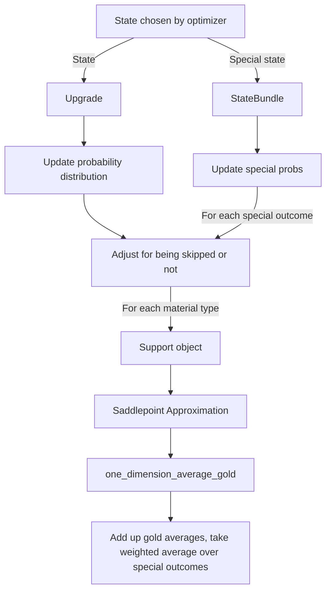

# Average Evaluation

The math behind this can be found in [the white paper](/docs/Saddlepoint%20Approximation.pdf). Here's the order that things occur in:

Some points to note:

- The probability dist update is different from normal and advanced honing, adv honing has 3 different distributions for cost, juice and scroll
- We "collapse" the probability distribution by removing duplicates and 0 probability events.
- All of these distributions are considered "linear", as in the gap size between each non-zero prob support is constant.
