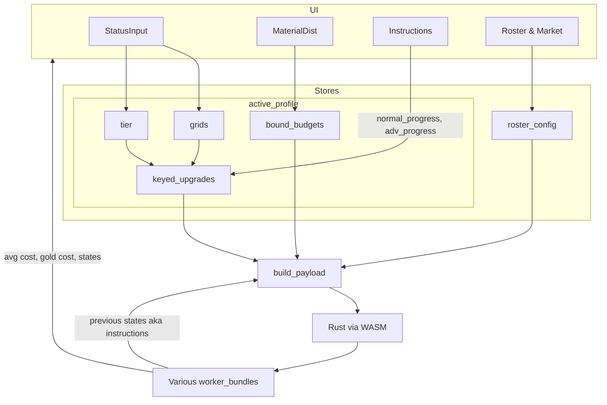

# Frontend

I will try my best to describe the general flow of information here. By no mean is this exhaustive and does not differentiate between watch dependency and direct callbacks. This is subject to change and I will try my best to update when it does.

