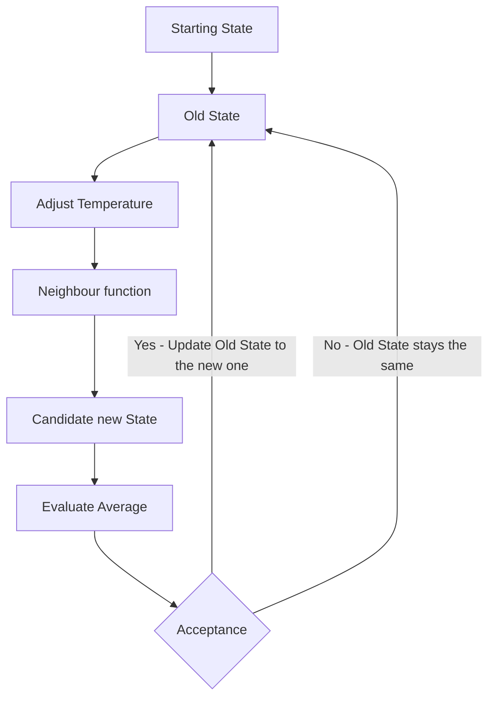

# Optimizer

I will give an outline of the Simulated Annealing utilized below:

The exact implementation of the neighbour function, acceptance function and the annealing schedule (Adjust Temperature) significantly impact the performance of the algorithm. They have a lot of room to improve and are very much subject to change so I will not go into more detail.

## Testing new algorithms

I'm sure there is a better way of doing this. Right now, what you need to do is the following:

1. Add another folder in the module folder (e.g. /crates/core/src/optimizer/v36). I would suggest copy-pasting the existing version and modifying it from there.
2. Add another `cfg_if` block to [mod.rs](/crates/core/src/optimizer/mod.rs) (the outer layer, not the one in the folder you just made).
3. Add another feature to [Cargo.toml](/crates/arena/Cargo.toml) in Arena. For example: `v36=["hf-core/v36"]`
4. Make your adjustment to the optimizer. There are some assumptions made about what is changed, which is mostly done by the `Neighbour` function. You must abide by the following:
    - `special_state` should be a permutation of the indices of upgrade_arr (upgrade_arr should never be re-ordered)
    - You must not change the length of State, it should always have the same length as clean_prob_dist_len (or 2 in the case of Advanced honing). This is a more of a front-end problem.
    - `book_id` must be an element in `juice_info.normal_uindex_to_id[upgrade.upgrade_index]`. A `book_id` of 0 indicates no book (juice usage is controlled by the boolean)
    - The `book_id` field for advanced honing must not exceed `MAX_ADV_STATE` (it can equal `MAX_ADV_STATE`).
    - You must call `upgrade.update_hash` after changing the state of an upgrade.
5. To test your new version, run `npm run optimizer_test YOUR_VERSION` (This should be ran from the project root).
6. You can view how it compares to other versions by running `optimizer-visualizer`.
